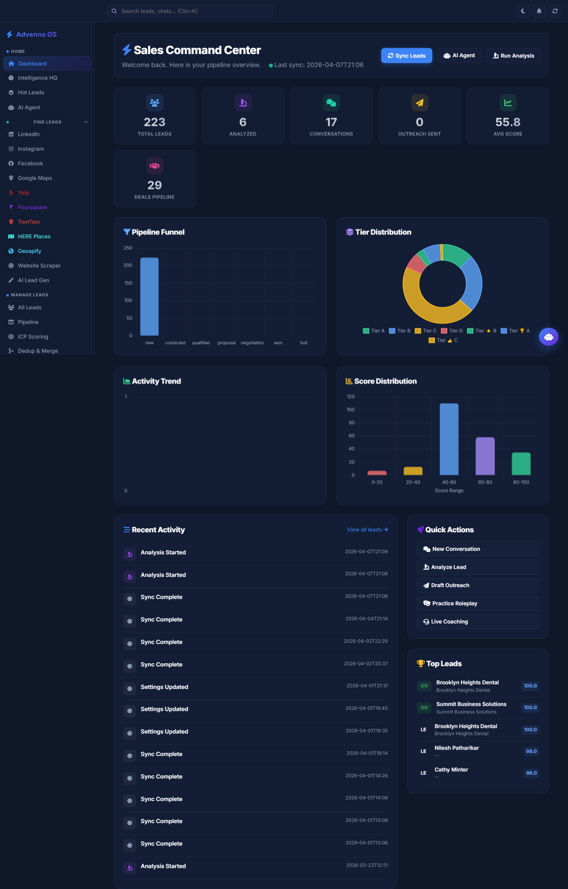
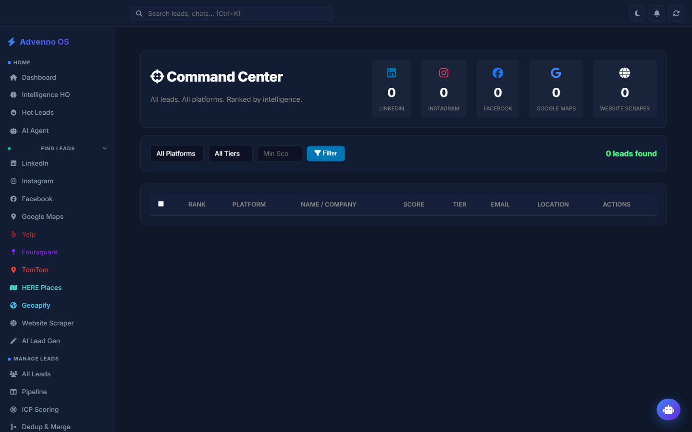
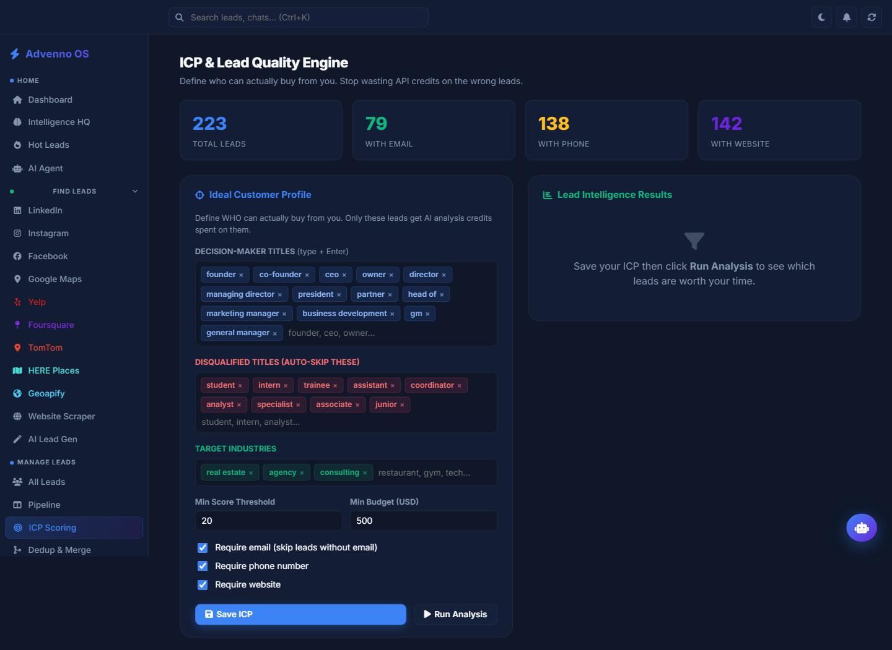
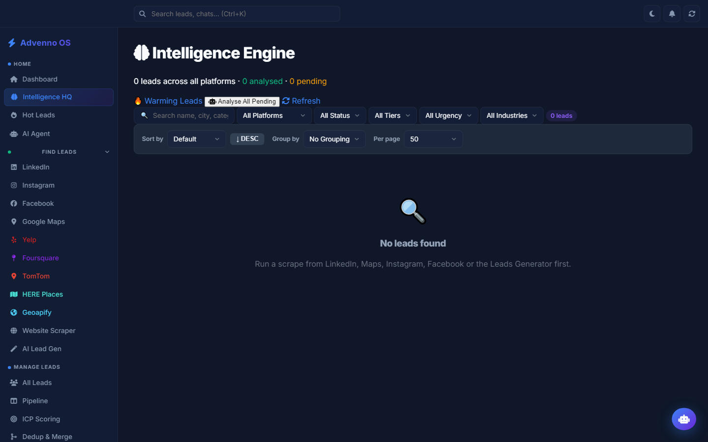
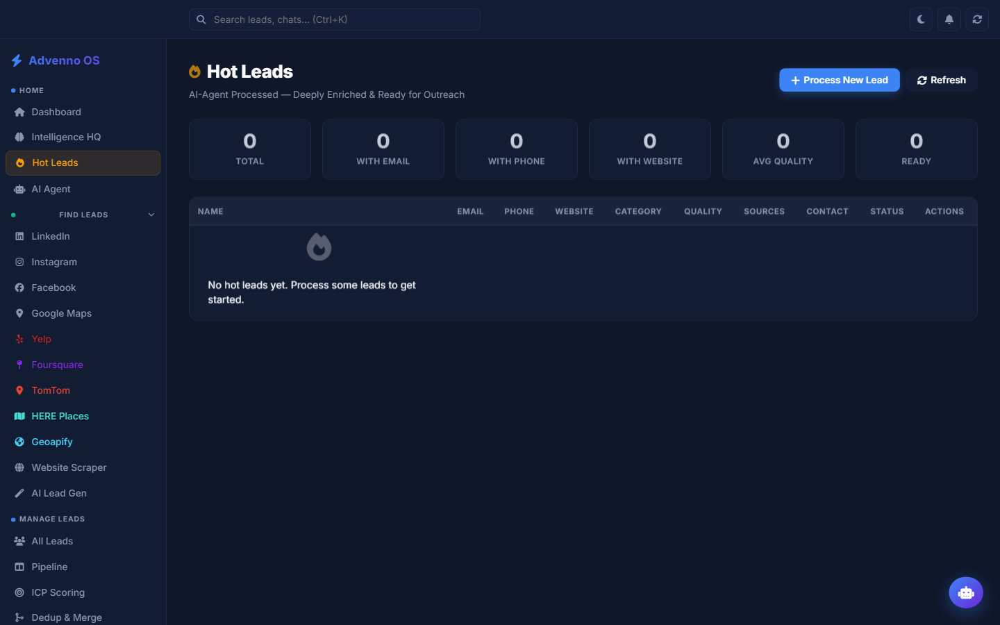

# Advenno AI Sales Agent — Automated Lead Generation & Outreach

> **Find your next clients automatically — scraped, enriched, scored, and contacted by AI.**

The Advenno AI Sales Agent is an end-to-end lead generation and outreach platform. It discovers business leads from multiple sources, enriches them with intelligence, scores them for fit, and runs personalized multi-channel outreach — so your pipeline fills itself.

---

## Screenshots

A look inside the Advenno AI Sales Agent platform.

### Sales Command Center Dashboard

*Real-time overview: total leads, pipeline funnel, tier distribution, score trends, and recent activity.*

### Command Center — Multi-Platform Lead View

*All leads from every source — LinkedIn, Instagram, Facebook, Google Maps, website scraper — ranked by AI intelligence.*

### ICP & Lead Quality Engine

*Define your Ideal Customer Profile — decision-maker titles, target industries, score thresholds — so AI credits are spent only on leads worth pursuing.*

### Intelligence Engine

*Deep AI enrichment and analysis across every platform, with filtering by status, tier, urgency, and industry.*

### Hot Leads — Ready for Outreach

*AI-processed, fully enriched leads — with email, phone, website, and quality score — ready for outreach.*

---

## What is the Advenno AI Sales Agent?

**It is an AI-powered sales prospecting and outreach platform.** It automates the entire top of the sales funnel: finding leads, researching them, prioritizing them, and reaching out — across email, WhatsApp, and SMS.

It is built for **agencies, B2B sales teams, and founders** who want a predictable flow of qualified prospects without manual list-building and cold-research grind.

---

## Key Features

- **Multi-source lead scraping** — discovers businesses from Google Maps, Facebook, Foursquare, Geoapify, and more.
- **AI lead enrichment** — augments each lead with business intelligence from multiple data providers.
- **Smart lead scoring** — ranks leads by fit so your team works the best opportunities first.
- **AI-personalized outreach** — generates tailored messages instead of generic templates.
- **Multi-channel sending** — reaches prospects via email, WhatsApp, and SMS.
- **API key rotation** — designed to scale across data sources reliably.
- **Command center dashboard** — manage scraping, enrichment, and campaigns from one interface.
- **Exports** — push lead lists to spreadsheets for your CRM or team.

---

## Who It's For

| Audience | Why it helps |
|----------|--------------|
| **Marketing & branding agencies** | Keep the new-business pipeline full automatically. |
| **B2B sales teams** | Spend time closing, not list-building. |
| **Founders & solopreneurs** | Run outbound without hiring an SDR team. |
| **Lead-gen services** | Deliver enriched, scored lead lists at scale. |

---

## How It Works

1. **Define your target** — industry, location, and criteria.
2. **Scrape** — the agent pulls matching businesses from multiple sources.
3. **Enrich** — each lead is augmented with additional business intelligence.
4. **Score** — leads are ranked by how well they fit your offer.
5. **Reach out** — AI generates personalized messages and sends across email, WhatsApp, and SMS.
6. **Export & track** — manage everything from the dashboard and export lists as needed.

---

## Technology

- **Backend:** Python, Flask
- **AI:** large language models for enrichment, scoring, and message generation
- **Data sources:** Google Maps, Facebook, Foursquare, Geoapify, and additional enrichment APIs
- **Outreach:** email (SMTP), WhatsApp, SMS
- **Interface:** web-based command center dashboard

> This repository is a **public showcase**. It documents the product — it does not contain the scraping logic, enrichment pipeline, scoring model, or any source code.

---

## Frequently Asked Questions

**Where do the leads come from?**
Multiple business-discovery sources including Google Maps, Facebook, Foursquare, and Geoapify.

**What does "enrichment" mean?**
Each raw lead is augmented with additional business intelligence so your team has context before reaching out.

**How does lead scoring work?**
Leads are ranked by how well they match your target profile, so the best opportunities rise to the top.

**What channels can it reach prospects on?**
Email, WhatsApp, and SMS.

**Are the outreach messages personalized?**
Yes. Messages are AI-generated and tailored per lead — not generic blasts.

**Can I export the leads?**
Yes. Lead lists can be exported to spreadsheet formats for your CRM or team.

**Is this open source?**
No. This repository is a marketing showcase. The product is proprietary — see the license.

**How do I get access?**
See the **Contact** section below.

---

## Why the Advenno AI Sales Agent

- 🔁 **End-to-end** — discovery to outreach in one system.
- 🧠 **Intelligent** — enrichment and scoring, not just raw lists.
- 📣 **Multi-channel** — meet prospects where they are.
- 📈 **Scalable** — built to run outbound at volume.

---

## Contact & Demo

Built by **Advenno** — Full-Stack Brand Building.

- **Website:** [advenno.com](https://advenno.com)
- **Email:** [hello@advenno.com](mailto:hello@advenno.com)
- **GitHub:** [@maaz-gobi](https://github.com/maaz-gobi)

Want a predictable, automated pipeline of qualified leads? Get in touch to discuss your target market.

---

## License

This is a proprietary product by Advenno. This repository contains documentation and marketing materials only. See [LICENSE](LICENSE) for terms.

---

**Keywords:** AI sales agent, lead generation, automated outreach, B2B prospecting, lead scraping, Google Maps leads, lead enrichment, lead scoring, cold outreach automation, sales automation, WhatsApp outreach, SMS outreach, email outreach, AI SDR, sales pipeline automation, Advenno.
